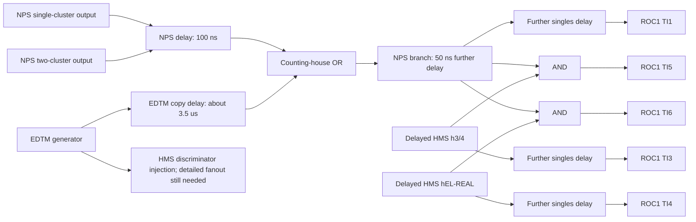

# Dated logbook routing and its livetime implications

UTC2026-09-10 continuation. **Use the reported ROC1 mapping as the working
configuration for these runs**, based on the user's applicability confirmation.
The two source entries are [4170042,2023-08-23](https://logbooks.jlab.org/entry/4170042)
and [4171556,2023-08-29](https://logbooks.jlab.org/entry/4171556). Both predate
the February2024 production data. Text, dates and URLs were provided by the
user; the web tool returned401 token_expired, so original pages/attachments
were not independently retrieved. This is substantive routing evidence, not
merely the NPSlib timing comment. It does not establish absence of every later
change, but no further applicability confirmation is requested.

`user_excerpts.txt` preserves the supplied words with normalized line wrapping;
`provenance.json` records the source and access limitation. This is not an
original logbook export. No new raw input, production edit or LaTeX change.

## Distinguish three trigger-number namespaces

The August23 entry labels local NPS outputs and the cables sent to the counting
room. The August29 entry labels the inputs to ROC1 TI after counting-house
logic. These are different locations; identical numbers need not mean the
same signal. The VTP module's internal decision bits are a third namespace.

| Number | Local NPS TS / outgoing cable (Aug23) | ROC1 TI input (Aug29) |
|---|---|---|
| 1 | Single cluster | NPS single-cluster OR two-cluster OR delayed EDTM |
| 2 | Cosmic scintillator | NPS cosmic OR LED |
| 3 | Cosmic-column OR of crates | HMS h3/4 |
| 4 | Cosmic-column AND of crates | HMS hEL-REAL |
| 5 | VLD | TI1 AND TI3 |
| 6 | At least two clusters | TI1 AND TI4 |

In particular, **ROC1 TI6 is a coincidence, not simply the local NPS
two-cluster output**. The NPSlib VTP bit descriptions do not replace either
column in this table. VLD is explicitly reported as traversing
FADC->VTP->V1495->TS; the directly injected counting-house EDTM copy takes a
different route. Do not identify the VLD timing test with EDTM coverage.

## Reported route and timing

This schematic shows signal relationships, not calibrated gate propagation or
an independently measured hardware diagram. The exact HMS discriminator
fanout, including the pulser route forming hEL-REAL, is not detailed in the
excerpt and remains a verification item.



The reported HMS cable loops give about3.5us delay. Before the loops the h3/4
and hEL-REAL pretriggers differ by40ns;27ns is added to h3/4 at the counting
house. HMS EDTM injection is described as about52ns ahead of h3/4 there.
At coincidence formation, HMS pulses are40ns wide and NPS100ns; HMS arrives
about40ns later so it sets the coincidence timing. Relative to coincidence,
singles reach TI later: NPS about40ns, HMS about24ns. Do not combine these
approximate observations into an exact calibrated delay without common
reference points. Deliberately earlier coincidences make trigger overlap and
enabled-input handling relevant; the TI's actual priority/arbitration behavior
is not reconstructed by this timing description alone.

The40ns HMS width does **not** establish PRE40 attribution. PRE100/150/200
also remain unidentified. Numerical similarity to these widths is not wiring
evidence. The August23 firmware capabilities (up to48ns hit coincidence,
5x5/7x7 waveform regions and full readout every N events) likewise do not give
the active parameter values of a particular run. N is a readout-pattern
setting, not automatically the trigger-prescale factor p.

## Connection to all43 production runs

`check_run_mapping.py` joins the frozen full-cache summary to frozen run
metadata. All43 runs have exactly one positive effective PS_N entry; its
trigger number and factor agree with the existing calculation. Aggregate
metadata labels such as2499-2512 are not individual run IDs and are skipped;
one unique match is required for every requested production run. No event
file was reread. Counts below are whole-file inventory counts, not selected
EDTM exposure N. Full per-run mapping is in `run_trigger_interpretation.csv`.

| Configured input | Runs | Whole-file events | Physical interpretation under supplied mapping |
|---|---:|---:|---|
| TI6 | 5:4253,4254,4255,4256,4259 | 2,706,910 | NPS branch AND HMS EL-REAL coincidence |
| TI4 | 38:4300 through4558, selected production runs | 75,131,474 | HMS EL-REAL singles |

TI6 runs are dated2024-02-08. The TI4 cohort starts2024-02-10. Four TI6 runs
have p=1 and4259 has p=5;33 TI4 runs have p=1 and five have p=2. The metadata
`coin_status` string is not substituted for the explicit enabled-trigger
fields: e.g.4259 says off there but has ps6=3 (effective p=5). This identifies
a field-interpretation distinction, not evidence the stated TI6 logic was off.
The existing raw/TI selected-bit checks remain separate evidence; this join
does not establish a new hardware prescale readback.

## What EDTM can and cannot measure

**Established from the reported route:** the direct delayed EDTM copy joins
the NPS branch at the counting house. It bypasses NPS cluster formation in
the FADC/VTP/V1495 trigger chain. Therefore its survival cannot establish the
efficiency of that upstream NPS physics-trigger formation. Some such losses
are threshold/trigger-acceptance effects and some may be rate-dependent;
do not label all of them DAQ livetime or silently multiply another factor.

For **TI6 coincidence runs**, a pulser used as a coincidence probe must reach
both the NPS OR and the selected HMS EL-REAL branch with adequate overlap.
EDTM can then test survival of that injected coincidence through the portions
of the paths it traverses and subsequent acquisition. Injection/fanout
efficiency, sent-scaler tap, timing acceptance, prescale sampling and accidental
tagging remain conditions. NPS upstream physics-trigger formation needs its
own evidence for total physics normalization.

For **TI4 singles runs**, acceptance is through HMS EL-REAL. The NPS hardware
cluster requirement is not part of this configured input under the supplied
map. EDTM survival must be interpreted for the sampled HMS/DAQ route; it
cannot be used to validate NPS reconstruction/readout efficiency. Conversely,
an extra NPS hardware-trigger survival factor should not be imposed on this
cohort merely because it is needed for a coincidence-triggered population.
How NPS information is read out and selected still matters independently.

`pE/D` remains a measured diagnostic count ratio. Periodic pulser availability
need not equal event-rate-weighted physics survival. A recorded EDTM-associated
TDC hit may coexist with an independently formed physics trigger. The new
wiring information supports a model, but does not convert every associated
hit into a causally identified pulser trigger. CLT_physics remains a candidate
definition only; agreement is not a calibration or validation criterion.

The4303/4305 raw/ROOT scaler exposure problem is unchanged by this routing
evidence. A biased or incomplete denominator cannot be fixed by knowing its
signal name. No replacement denominator, inferred count repair or production
interval exclusion has been introduced.

## Analysis decision and reproducibility

Keep TI4 and TI6 physical interpretations separate in future comparisons and
presentation. The fixed-yield normalization sensitivity already measured can
illustrate artificial run dependence, but is not observed cross-section bias.
Ignoring the change in required trigger stages could add another artificial
cohort dependence. No new numerical correction is calculated here.

Next: validate the sent-EDTM tap and HMS EL-REAL pulser path; find ROC5
readout/accumulation code to diagnose the counter deficit; evaluate any NPS
trigger-formation correction only for the appropriate population. Preserve
common event/scaler/yield/charge exposure and conditional loss-stage definitions.

From a fresh writable copy of this script, with the frozen archive accessible:

```bash
mkdir -p /tmp/nps_trigger_mapping_repeat
cp check_run_mapping.py /tmp/nps_trigger_mapping_repeat/
python3 /tmp/nps_trigger_mapping_repeat/check_run_mapping.py
sha256sum -c SHA256SUMS --quiet
```

The last command verifies this archive from its directory. Expected mapping
check:43 unique runs,5 TI6 and38 TI4; all factors match and the event total is
77,838,384. No ROOT setup, raw staging or login is required. `mapping_checks.json`
records input hashes and the working-map provenance. This is a reinterpretation
of verified counts with new routing evidence, not a repeat of the event analysis.
